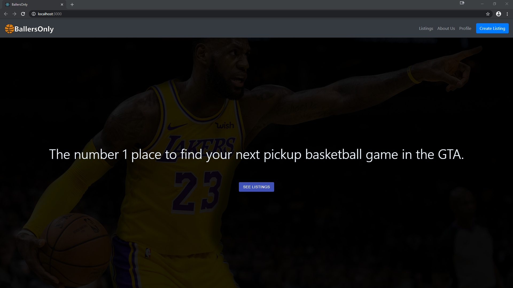
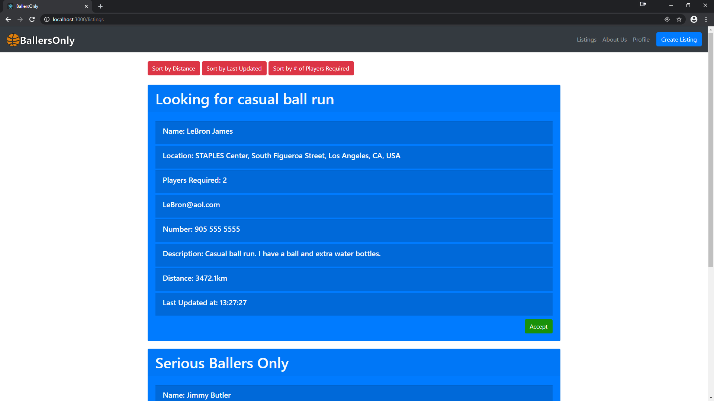
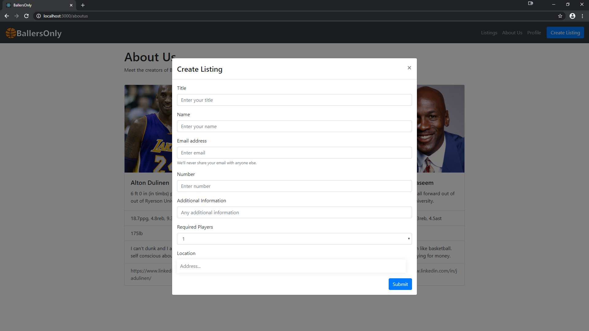
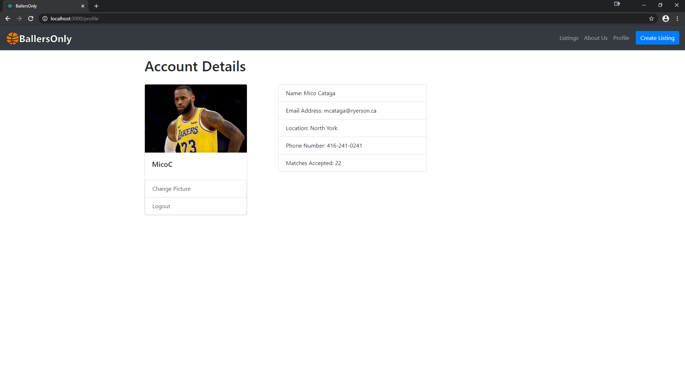

# BallersOnly Web App
A web application to help connect local basketball aficionados together. Built using the MERN stack. 

## Usage 
Clone repository and run 'npm install' once in the root directory and once under the '/backend' directory. To start the frontend, run 'npm start' in the root directory. To start the backend MongoDB connection, navigate to '/backend' and run 'nodemon server'. The app will be running on 'http://localhost:3000/'. You may require two separate terminal instances to run both the frontend and backend simultaneously.

## Work in Progress
* User account system
* Chat system
* Notification system
* New styling

## Screenshots

### Written by
Musab Jaseem, Manveer Gill, Alton Dulinen, Mico Cataga